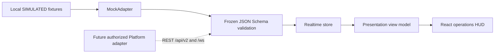

# HUD foundation specification — Architect review draft

Scope: local SIMULATED HUD foundation and the Architect-requested freshness correction milestone. Approved repository layout is apps/web (Vite + React + TypeScript) and packages/ui-kit. The existing contracts directory, database, workflow state and Edge repository are unchanged.

## Architecture

The future adapter is a documented boundary, not an implemented network client. The store manages immutable observations, scoped sessions, per-asset BigInt revisions, gap/reconnect resnapshot requests, and bounded local event history (40). Local reconciliation every 15 seconds never creates a fresh telemetry observation.

## Operational surface

The Whizdom header, Asia/Bangkok clock, persistent TEST/SIMULATED or DEMO banner, separate system/gateway health, five selectable shafts, confirmed labels, direction/motion, age/quality/alarm flags, selected details, local event stream and unavailable-until-measured analytics.

W-04 is COMMISSIONED / OUT_OF_SERVICE / monitoring disabled. Connection remains an independent axis and follows the fixture's actual value. W-05 code 22 is UNCALIBRATED with a null displayAnchor. Both shaft and detail explicitly show raw/unknown state; there is no guessed floor position.

The UI uses provided floorDisplay/floorKind/floorProfileVersion/displayAnchor. It does not derive a floor from floorRaw. Fixtures contain only explicit sample label/anchor tuples; they are not a floor mapping implementation.

## Motion and accessibility

Confirmed floor and alarm changes render immediately. CSS interpolates only between the previous displayed position and the latest confirmed anchor; direction never schedules another floor. A fresh session/resnapshot remounts the shaft view, and stale/disconnected/unknown/source-invalid/gateway-offline conditions cancel interpolation. Hidden-tab and resize events snap the view before animation is enabled again. The operator switch and prefers-reduced-motion are supported. The standalone motion utility also has bounded interpolation tests; real CSS behavior is separately exercised by browser QA.

Use semantic buttons and keyboard selection, visible focus indicators, text plus color for statuses, Thai labels, local system-font fallbacks, and a horizontally scrollable shaft region on small screens. No third-party font/image/CDN requests are required. The dark navy/cyan design is an operational HUD shell; visual acceptance by the owner is pending.

## Freshness correction semantics

The Architect accepted Milestone 01 as PASS WITH REQUIRED CORRECTIONS. The 12-second local stale assumption is superseded; the historical milestone report remains unchanged as evidence.

| Independent axis | Current rule |
| --- | --- |
| SIM source state | age <30s FRESH; age >=30s STALE |
| REAL source state | valid ST age <90s VALID; age >=90s STALE |
| REAL field transport | valid frame age <75s OK; 75s <=age <90s AGING; age >=90s NO_RXTX |
| Gateway heartbeat | age <30s ONLINE; age >=30s OFFLINE |
| Browser WebSocket | disconnect immediately projects SERVER_DISCONNECTED and cancels car/door rendering motion |

Unknown/invalid evidence stays UNKNOWN. Reported connectionState, sourceFreshness, fieldTransportFreshness, gatewayHeartbeat and serverConnection remain separate. Disconnecting the browser does not change the held source age, confirmed position or server-reported field transport. A server-declared STALE or unavailable gateway/transport evidence conservatively disables motion.

The running adapter accepts only SIMULATED TEST/DEMO data. REAL freshness classification is covered by pure local tests; it introduces no LIVE adapter or hardware connection. Current frozen WS transportState is preserved as SERVER_REPORTED with ageSec=null; it is never derived from source ST age or WS receipt age.

A repeated snapshot, status-only update, heartbeat or repackaged source observation cannot renew source freshness. Identical/older source timestamps within one producer epoch preserve accumulated age even when serverReceivedAt changes. A repeated/older heartbeat preserves its monotonic age. Only distinct valid evidence can establish a new age baseline; dataset/session boundaries retain the existing scoped reset behavior. Reconciliation remains every 15 seconds.

The frozen MQTT heartbeat field description still links transport freshness to lastValidStateAt, which conflicts with the explicit separate-clock correction. This metadata discrepancy is recorded for Architect/Backend review; no frozen bytes are changed. C01 FAIL, ui-enums draft metadata mismatch and the root Ajv advisory remain open in their original independent-auditor evidence.
## Contract assumptions requiring Architect decisions

| Item | Local TEST policy | Production dependency |
| --- | --- | --- |
| displayAnchor | Normalized 0..1, not meters or floor number | Approved profile units, scale and bounds |
| source freshness | Supplied freshnessSec plus monotonic elapsed; SIM stale at 30s, REAL stale at 90s | FreshnessSec must represent valid source-state age; production clockQuality/lifecycle details remain to be confirmed |
| field transport freshness | Separate reported transportState; valid-frame age remains UNKNOWN in WS projection | Frozen WS DTO has no independent valid-frame timestamp/age; REAL 75s/90s bands are tested with explicit local unit-test ages |
| gateway heartbeat | Envelope sentAt minus lastHeartbeatAt at receipt, plus monotonic elapsed; OFFLINE at 30s | Local fixtures use one server clock domain; production timestamp comparability must be confirmed |
| revision gap | Per-asset decimal strings/BigInt; skipped +1 triggers conservative resnapshot | Whether revisions are contiguous; the frozen schema only promises monotonic greater-than |
| stream identity | Mock requires serverInstanceId, datasetEpoch, subscriptionId | Frozen envelope marks these optional; define required server behavior |
| gateway association | Explicit TEST_GATEWAY_ID serves all fixture lifts | Backend-owned lift-to-gateway association |
| gateway ordering | Retain known revisions across same-dataset snapshots | GatewayStatus snapshot has no revision baseline; first post-snapshot delta cannot be compared to one |
| reconciliation | Local 15s snapshots; no observation freshness reset | Atomic snapshot/buffer/watermark semantics and a defined revision heartbeat |
| source vs origin | source.live with SIMULATED/TEST; source.demo with SIMULATED/DEMO | Authorized session, source-switch and expiry behavior |
| events/alarms | Local adapter event labels and activeAlarmCount only | Confirmed alarm/event API, severity and workflow; no operator ACK command in this milestone |

The frozen bundle still contains ui-enums.yaml version metadata draft.1 while the release candidate is draft.2. This is recorded as an existing metadata discrepancy for Architect review; no frozen file was corrected. Runtime canonical enums come from frozen JSON Schema.

## Assets and dependencies

No raster art, external fonts, or icon packages are shipped. The shaft geometry and decorative frames are CSS/SVG. The typography uses fonts already installed on the operator's device.

Direct libraries: React/React DOM (MIT), Vite (MIT), TypeScript (Apache-2.0), Ajv/Ajv Formats (MIT), Vitest (MIT), Testing Library (MIT), jsdom (MIT), Playwright (Apache-2.0). Exact versions and transitive dependencies are in package-lock.json; installed package license metadata is available in their package.json files. The existing root Ajv 8.17.1 validator is preserved and has one moderate npm advisory; the frontend uses Ajv 8.20.0 and Vitest 4.1.11.

Gates remain WAITING_FOR_G-A / BLOCKED_ON_POSTGRES_EXECUTION_EVIDENCE. No site registration, hosting or Dell deployment is part of this work.
